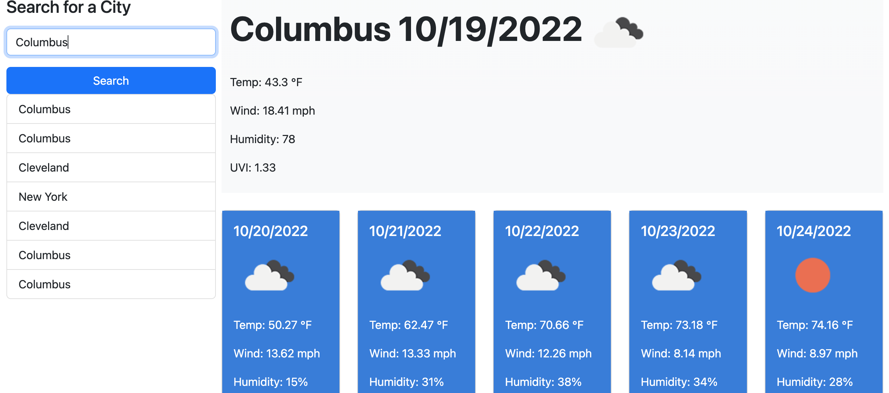

# Intuitive Weather Dashboard

## Description
This app is designed to allow a user to type in the name of a city and display current/future weather data for said city using OpenWeather API. Five future days of wather data are shown on the page along with the current day's weather on the large section at the top of the page. An icon is also shown with each data set to describe that day's weather (sunny. cloudy, rainy, etc). 

When the user enters a city into the search bar, their search history is saved to local storage and then shown on the page below the search bar. In future development, a feature will be added that allows a user to click on a previously searched city and chang the displayed data to that city's weather.

## Screenshot
A screenshot below shows the app's current appearance and functionality.

## Links
link to GitHub repository: https://github.com/dejuliusvince/Intuitive_Weather  
link to deployed application: https://dejuliusvince.github.io/Intuitive_Weather/

